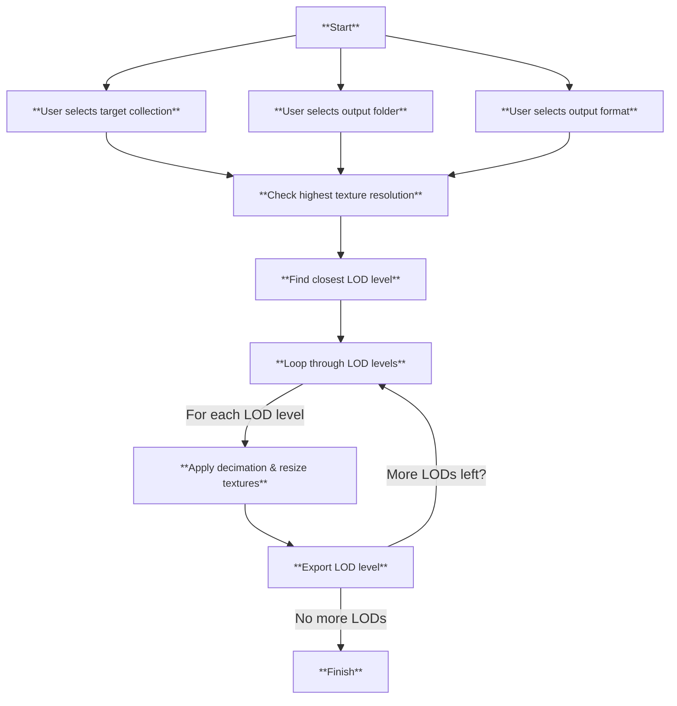

# LOD Generator Addon  

**Author:** [github.com/CarlaCGDM](https://github.com/CarlaCGDM)  
**Version:** 1.0  
**Blender Version:** 3.0+  
**Category:** Object  
---

## 📥 Installation  

1. Download the **LOD Generator** addon (`lod_generator.zip`).  
2. Open Blender and go to:  
   - **Edit → Preferences → Add-ons**  
3. Click **Install...**, then select the downloaded `lod_generator.zip` file.  
4. After installation, search for **"LOD Generator"** in the add-ons list.  
5. Enable it by checking the box.  
6. Save preferences and close the preferences window.  

---

## ⚠ Important: Unpack Textures  

If your model has **packed textures**, you **must** unpack them before running the addon!  

1. Go to **File → External Data → Unpack Resources**  
2. Choose **Overwrite**  

This ensures the addon can correctly read and resize textures.  

---

## 🎮 How to Use  

1. Open the **3D View** and find the addon under the **"Tools"** tab.  
   - If the sidebar is not visible, press **N** to show it.  

2. **Select the collection** containing your meshes.  
   - Each **model must have its own collection**.  
   - The model can consist of multiple objects; they will all be exported together.  

3. **Select an output folder** where the generated LODs will be saved.  

4. **Tweak the LOD level presets** as needed:  
   - Add or remove LOD levels.  
   - Adjust the settings for each level.  

5. **Press the "Generate LODs" button** to start the process.  

6. Find your **generated models** in the selected output folder.  

---

## 🔧 Troubleshooting  

- **Textures not resizing or missing?**  
  - Make sure they are **unpacked** as explained above.  

- **Addon not appearing in Blender?**  
  - Ensure it was installed correctly and enabled in **Edit → Preferences → Add-ons**.  
  - Restart Blender after installation if the addon is not showing up.  

---

## **Addon Workflow**

---

## 📬 Contact & Support  

For updates, issues, or feature requests, visit:  
[github.com/CarlaCGDM](https://github.com/CarlaCGDM)  
